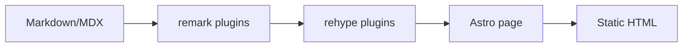

import Bilibili from "../../../components/embed/Bilibili.astro";
import YouTube from "../../../components/embed/YouTube.astro";
import CodePen from "../../../components/embed/CodePen.astro";

这篇文章用于验证 Phase 3 的正文能力：数学公式、流程图代码块、提示框、脚注，以及三类外部内容嵌入。所有嵌入都使用独立 Astro 组件，不依赖文章布局的特殊处理。

## KaTeX 公式

行内公式可以写成 $E = mc^2$。块级公式用于展示更完整的推导：

$$
\int_{-\infty}^{\infty} e^{-x^2}\,dx = \sqrt{\pi}
$$

在控制系统里，也可以把离散状态更新写成：

$$
x_{k+1} = A x_k + B u_k + w_k
$$

## Mermaid fenced block

下面是一个 Mermaid fenced block，便于后续渲染链路接管；在未启用 Mermaid 客户端渲染时，它仍然会作为代码块安全输出。

## Admonition

:::tip{title="Phase 3"}
这是一段通过 `remark-directive` 和自定义 admonition 插件转换的提示框。
:::

:::warning{title="外部嵌入"}
外部 iframe 依赖第三方站点可用性；构建时只生成静态 HTML，不会请求这些资源。
:::

## Footnotes

脚注适合补充不会打断正文节奏的说明。这里放一个简短注释。[^phase3]

[^phase3]: GFM footnotes 由现有 `remark-gfm` 支持。

## Bilibili

<Bilibili bvid="BV1xx411c7mD" title="Bilibili 嵌入示例" />

## YouTube

<YouTube videoId="dQw4w9WgXcQ" title="YouTube 嵌入示例" />

## CodePen

<CodePen
  user="Mamboleoo"
  hash="XWJPxpZ"
  title="CodePen 嵌入示例：Walkers - How to"
  defaultTab="js,result"
/>
